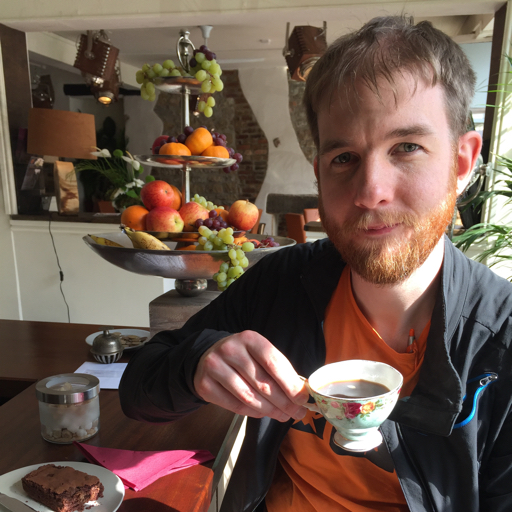

+++
title = "About Phill"
seo_title = "About Phill Sparks | Climbing Instructor & Coach"
description = "Learn about Phill Sparks, a Senior Outdoor Instructor and Mountain Training Course Director based in Leicestershire with 15+ years of climbing experience."
date = 2026-10-03T00:00:00Z
layout = "about"
toc = false
association = "mta"

[menu.main]
  name = "About"

[[resources]]
  src = "phills.jpg"
  title = "Photo of Phill Sparks drinking a cup of coffee"
+++

{.circle .center .small}

## Climber • Instructor • Coach

I have been climbing in some small way most of my life—whether on furniture at home, trees at the local park, taster sessions with Scouts, or weeks away on holiday. Over 15 years ago, I rediscovered climbing with friends while at university, which sparked my regular, independent climbing journey.

Shortly after, I began assisting with climbing and crate stacking at a local Scout campsite. Since then, I have worked across local authority, commercial, and voluntary sectors as a Senior Outdoor Instructor, Course Director, and Coach. My qualifications allow me to instruct top-rope climbing and abseiling indoors and at natural rock crags, as well as teach lead climbing, all grounded in a supportive coaching approach.

As Senior Instructor at [Beaumanor Hall](https://www.beaumanorhall.co.uk), I oversee rope activities—including climbing, abseiling, high ropes, and zip wire—while supporting the wider outdoor activity programme, managing staff training, technical delivery, and safety equipment. Alongside this, I coach junior lead climbing and improver sessions at [Climb Leicester - The Tower](http://localhost:1313/about/#), deliver Mountain Training's [Indoor Climbing Assistant]() scheme as an approved Course Director, and assess [Scout Climbing and Abseiling permits]().

I hold the Rock Climbing Instructor (RCI), Climbing Wall Development Instructor (CWDI), and Foundation Coach accreditations, alongside being an approved Lyon PPE Inspector and ERCA High Ropes Instructor.

I enjoy climbing in all forms, especially sport and trad climbing outdoors when the weather allows, and indoor sport climbing year-round.

[beaumanor]: https://www.beaumanorhall.co.uk
[ica]: 
[scout-permits]: 
[tower]: http://localhost:1313/about/#